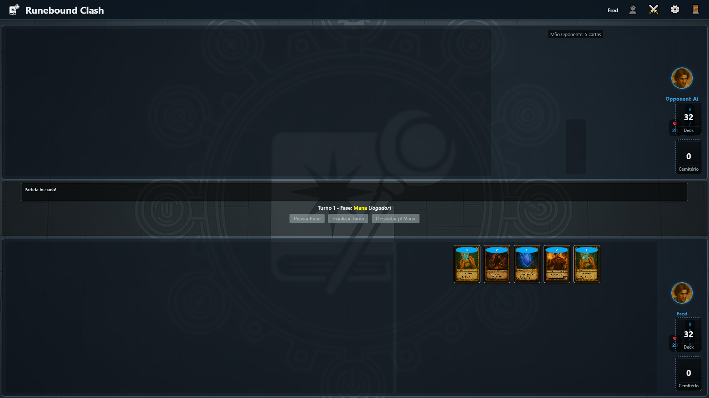

# Runebound Clash

<!-- Optional: Add badges here for build status, license, etc. -->
<!-- []() []() -->

A strategic 1v1 Card Game prototype built with HTML, CSS, and JavaScript. Players invoke creatures, cast powerful Runebindings, and utilize instant spells in a turn-based battle to reduce their opponent's life points to zero. This project features a unique mana system where players must intentionally discard cards to gain maximum mana.

**Note:** This is currently a prototype focusing on the front-end structure, account management, deck building, and simulating a local game loop. Networking for true online play is planned for future development.


<!-- TODO: Add a better banner image or GIF showing gameplay -->

## Table of Contents

*   [Overview](#overview)
*   [Features](#features)
*   [Screenshots](#screenshots)
*   [Tech Stack](#tech-stack)
*   [Setup & Installation](#setup--installation)
*   [Usage](#usage)
*   [Development Status](#development-status)
*   [Future Development](#future-development)
*   [Contributing](#contributing)
*   [License](#license)

## Overview

Runebound Clash is inspired by classic collectible card games (CCGs). Key gameplay elements include:

*   **Card Types:**
    *   **Creatures:** Units with Attack and Toughness used for combat.
    *   **Runebindings:** Enchantments providing ongoing or temporary effects.
    *   **Instants:** Spells with immediate effects.
*   **Mana System:** Players start at 0 mana and must discard a card during their Mana Phase to gain 1 maximum mana (up to 10). Mana refills each turn.
*   **Deck Building:** Players construct decks of 30 to 40 cards.
*   **Turn Structure:** Includes Mana, Draw, Main, Attack, and End phases.
*   **Goal:** Reduce the opponent's starting 20 life points to 0.

This project serves as a foundation for the game, implementing the core UI flow, account management, and the basic structure for game logic.

## Features

*   **Dynamic UI Generation:** HTML structure for all screens is generated dynamically using JavaScript template modules.
*   **Account System:**
    *   Create multiple local user accounts.
    *   Login/Logout functionality.
    *   User data (profile info, collection, decks, history) stored in `localStorage`.
    *   **Security Warning:** Passwords are currently stored locally in plain text (INSECURE - for prototype purposes only).
*   **Profile Screen:**
    *   Displays user stats (Rank, Wins/Losses).
    *   Avatar selection and persistence.
    *   View unlocked card collection.
    *   View match history (placeholder).
    *   List of saved decks.
*   **Deck Builder:**
    *   Visual drag-and-drop interface (using SortableJS) to manage decks.
    *   Filter collection by name, type, cost, and tribe.
    *   Deck validation (30-40 cards, max 4 copies of each card).
    *   Save, load, and clear decks.
*   **Game Simulation:**
    *   Basic turn progression through phases (Mana, Draw, Main, Attack, End).
    *   Mana system simulation (discard-for-mana action).
    *   Basic card playing from hand (mana cost deduction).
    *   Combat phase structure (attacker/blocker declaration flow initiated).
    *   Game log to track basic actions.
    *   **Note:** Full card effect implementation and combat damage resolution are still under development (see [To do list.txt](To%20do%20list.txt)).
*   **Screen Management:** Smooth transitions between different application screens (Splash, Title, Login, Create Account, Profile, Connect, Deck Builder, Options, Battle).
*   **Options Menu:** Basic settings for audio volume, graphics (placeholder), and UI (language, text size, contrast) saved locally.
*   **Visual Feedback:** Loading indicator on splash, form validation feedback (shake animation on error).

## Screenshots

<!-- TODO: Add screenshots of key screens -->


*Screens Example:*




## Tech Stack

*   **Frontend:** HTML5, CSS3, JavaScript (ES6 Modules)
*   **Libraries:**
    *   jQuery (DOM manipulation and event handling)
    *   SortableJS (Drag-and-drop functionality for Deck Builder)
*   **Architecture:** Modular JavaScript structure (Core Logic, UI, Account, Data, Templates).

## Setup & Installation

As this is a pure front-end project (currently), setup is straightforward:

1.  **Clone the repository:**
    ```bash
    git clone https://github.com/YOUR_USERNAME/Runebind.git
    cd Runebind
    ```
2.  **Open the game:**
    *   Navigate to the `runebound-clash` directory.
    *   **Recommended:** Use a local web server to serve the files. This is often necessary for ES6 modules (`import`/`export`) to work correctly due to browser security restrictions (CORS) when loading files directly via `file:///`.
        *   **Using Python:**
            ```bash
            cd runebound-clash
            python -m http.server
            # Then open http://localhost:8000 in your browser
            ```
        *   **Using VS Code:** Install the "Live Server" extension and click "Go Live" from the bottom-right status bar after opening the `runebound-clash` folder or `index.html`.
    *   **Directly opening `index.html`:** You *can* try opening `runebound-clash/index.html` directly in your browser, but it might fail to load modules depending on your browser and settings.

## Usage

1.  Upon loading, you'll see the splash screen followed by the **Title Screen**.
2.  Choose **Create Account** or **Login** if you already have an account.
3.  After logging in, you'll land on the **Profile Screen**.
    *   Explore your (default) card collection.
    *   Manage your decks using the **Deck Builder** (accessible via the "Gerenciar Decks" button). Note the drag-and-drop functionality requires creating/editing a deck.
    *   Change your avatar.
4.  From the Top Bar (once logged in):
    *   Navigate between Profile, Connect, and Options.
    *   Use the **Connect** screen to simulate starting a game (currently initiates a local solo game).
5.  In the **Battle Screen** (simulation):
    *   Observe the basic turn flow.
    *   Try the "Descartar p/ Mana" button during the Mana phase.
    *   Play cards from your hand during the Main phase (if you have mana). Note that most card *effects* are not yet implemented.
    *   Attempt to declare attackers during the Attack phase. The UI flow for blocking is present but combat resolution logic is pending.
    *   Use "Passar Fase" and "Finalizar Turno".
6.  Use the **Options** screen (accessible from Title Screen or Top Bar) to adjust settings.

## Development Status

**Current State:** Alpha / Prototype

This project has a solid foundation with working account management, deck building UI, screen transitions, and the basic structure for the game loop and combat phases.

**Key Completed Areas:**
*   Core project structure and module setup.
*   Dynamic HTML generation from templates.
*   Account creation, login, persistence (`localStorage`).
*   Profile screen UI rendering (stats, avatar, collection, decks).
*   Deck Builder UI with drag-and-drop (SortableJS), filtering, validation, and saving/loading.
*   Basic game state management (`Game.js`).
*   Turn and phase progression (`TurnManager.js`).
*   Basic simulation of card playing (mana cost) and combat phase initiation (`CombatManager.js` structure).

**Key Pending Implementation (Refer to [To do list.txt](To%20do%20list.txt)):**
*   **Card Effect Logic:** Implementing the actual game logic for *all* card effects in `RunebindingCard.js` and `InstantCard.js`. (Critical Priority)
*   **Combat Resolution:** Implementing damage calculation and application in `CombatManager.js`. (Critical Priority)
*   **Targeting System:** Implementing logic for selecting valid targets for spells and abilities.
*   **Attacker/Blocker Confirmation:** Finishing the UI flow and logic for confirming attack/block declarations.
*   **End-of-Turn Discard:** Fully implementing the forced discard down to hand size limit.
*   **Status Effects/Boosts:** Implementing application, tracking, and removal of temporary effects.
*   **Networking:** Adding actual network capabilities (WebSockets or WebRTC) for online play.

## Future Development

Beyond the critical pending items, future plans include:

*   Full implementation of all defined card effects and abilities.
*   Robust combat system with animations and clear visual feedback.
*   Advanced targeting rules (e.g., hexproof, protection).
*   Implementing **Networking** for true 1v1 online matches.
*   Adding sound effects and background music.
*   Implementing animations for card actions (drawing, playing, attacking, dying).
*   Adding a dedicated Deck Selection screen before matches start.
*   Expanding the card pool and adding more complex mechanics.
*   Improving overall UI/UX polish and feedback.

## Contributing

This is currently a personal project/prototype. However, feel free to fork the repository, explore the code, and open issues for bugs found or suggestions.

<!-- If you want contributions:
Pull requests are welcome. For major changes, please open an issue first to discuss what you would like to change. Please make sure to update tests as appropriate.
-->

## License

<!-- Choose a license if desired, e.g., MIT -->
This project is currently unlicensed. Please contact the owner for usage rights.
<!-- Or:
[MIT](LICENSE.txt)
-->

<!-- Optional: Add contact info -->
fredericomonteiromendesmaia@gmail.com
<!-- Your Name / Project Link -->
